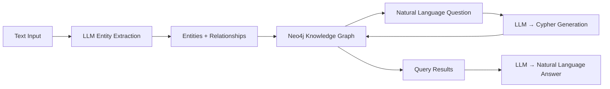

# GraphRAG Demo

Knowledge graph + LLM pipeline: **extract entities and relationships from text → store in Neo4j → query with natural language via auto-generated Cypher**.

## Architecture



## What it demonstrates

| Skill | How |
|-------|-----|
| **GraphRAG** | Entity + relation extraction, graph-augmented retrieval, multi-hop reasoning |
| **Neo4j** | Graph database, constraints, nodes, relationships |
| **Cypher** | Pattern matching queries, CREATE/MERGE/MATCH, constraints |
| **LangChain patterns** | LLM → Cypher generation, graph QA chain logic |
| **Docker** | Multi-service (app + Neo4j), healthcheck, volumes |

## Quick Start

```bash
git clone https://github.com/Vadtop/graphrag-demo.git
cd graphrag-demo

# Configure
cp .env.example .env
# Edit .env: set OPENAI_API_KEY

# Run with Docker
docker-compose up --build

# API docs
open http://localhost:8000/docs
# Neo4j browser
open http://localhost:7474
```

## API Endpoints

| Method | Endpoint | Description |
|--------|----------|-------------|
| `POST` | `/ingest` | Ingest text → extract entities/relations → store in Neo4j |
| `POST` | `/cypher` | Execute raw Cypher query |
| `POST` | `/ask` | Ask in natural language → Cypher → answer |
| `GET` | `/entities` | List all entities (optional `?label=Technology`) |
| `GET` | `/graph/stats` | Node/relationship counts by label/type |
| `GET` | `/health` | Health check (Neo4j connection) |

## Example Usage

```bash
# Ingest text
curl -X POST http://localhost:8000/ingest \
  -H "Content-Type: application/json" \
  -d '{"text": "LangChain uses ChromaDB for vector storage. RAG combines retrieval with LLM generation.", "source": "my_notes"}'

# Ask in natural language
curl -X POST http://localhost:8000/ask \
  -H "Content-Type: application/json" \
  -d '{"question": "What does LangChain use for storage?"}'

# Raw Cypher query
curl -X POST http://localhost:8000/cypher \
  -H "Content-Type: application/json" \
  -d '{"cypher": "MATCH (t:Technology)-[:USES]->(db) RETURN t.name, db.name"}'

# Graph statistics
curl http://localhost:8000/graph/stats
```

## Cypher Patterns Used

```cypher
-- Create entity with constraint
CREATE CONSTRAINT entity_name IF NOT EXISTS
FOR (e:Entity) REQUIRE e.name IS UNIQUE;

-- Merge entity (idempotent)
MERGE (t:Technology {name: "RAG"});

-- Create relationship
MATCH (a:Technology {name: "RAG"}), (b:Tool {name: "Qdrant"})
MERGE (a)-[:USES]->(b);

-- Multi-hop query
MATCH (a)-[:USES]->(b)-[:PART_OF]->(c) RETURN a.name, b.name, c.name;

-- Aggregation
MATCH (e:Technology) RETURN e.name, count{(e)-->()} as connection_count
ORDER BY connection_count DESC;
```

## Tech Stack

- **FastAPI** — async web framework
- **Neo4j** — graph database (community edition)
- **OpenAI API** — entity extraction + Cypher generation + answer generation
- **Docker** — app + Neo4j with healthcheck and persistent volumes

## License

MIT
